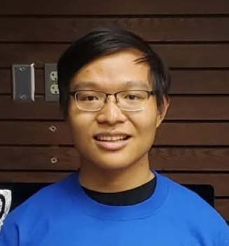

# About

{: align=left width=100px style='border-radius:40px;' }

I am a sophomore majoring in Computer Science and Mathematics at the University of Nebraska-Lincoln. 
I love everything about the computer and programming.
My research focus now is software testing and verification techniques.

### Resume

- [Full Resume (2 pages)](resume/2021_full_cv.pdf){target=_blank}
- [Short Resume (1 page)](resume/2021_short_cv.pdf){target=_blank}

### News
- 12/2020: **ICSE'21** research paper on program interactions learning using decision trees (with Professor ThanhVu).
- 7/2020: **ICSME** NIER paper on using symbolic execution to analyze the Linux build system (with Professor ThanhVu).
- 6/2020: Started doing Production Engineering Intern at **Facebook**.
- 3/2020: Joined [**UNSAT**](https://nguyenthanhvuh.github.io/research/group/){target=_blank} research group.
- 11/2019: Won first prize at site, second in region at the **ICPC** North Central NA Regional Contest (with Quan and Cuong).
- 8/2019: Started studying at **UNL**.

*[ICSE]: International Conference on Software Engineering
*[ICSME]: International Conference on Software Maintenance and Evolution
*[NIER]: New Idea and Emerging Results
*[UNSAT]: University of Nebraska Software Analysis and Testing
*[NA]: North America
*[ICPC]: International Collegiate Programming Contest
*[UNL]: University of Nebraska-Lincoln
